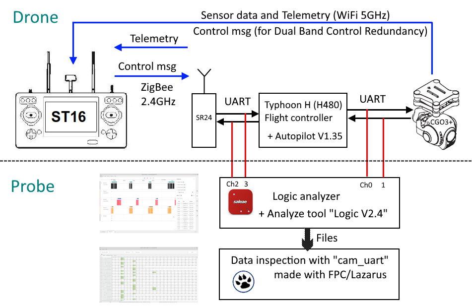

It's interesting to understand the message format of the communication between remote controller ST16 and drone H480 as well as the communication from flight controller to gimbal/camera CGO3+. This may help to create or improve projects to use camera or remote controller for other systems and further development of Thunderbird firmware (see here).
A first setup using a Raspberry Pi is described here: https://github.com/h-elsner/SR24_decode

Now I tried to bring together the communication of 
    • ST16 <-> SR24 and 
    • Autopilot (FC = Flight controller) <-> CGO3+.

I got a Saleae Logic Analyzer with four channels. To record I use this analyzer software: https://www.saleae.com/pages/downloads
